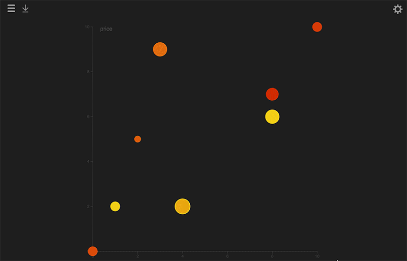

# Cartesify

## What's this?

A tool to visualize a dataset in different ways. Each dataset element has several attributes with different values.

Current visualizations:
- X / Y cartesian axis, that allows to code attribute values with x, y, radius, color. The visual feature that codes each attribute can be selected in the side panel.
- Radar graphs that places each attribute in an axis.

You can see a live demo here: http://damagedgoods.github.io/cartesify/#

## How can I use it with my own data?

1. At https://github.com/damagedgoods/cartesify, click "Clone or download" and then "Download ZIP".
2. Unzip the downloaded file.
3. Edit the file data.js. Change the elements as you wish. Just make sure you respect the syntax. Save the changes.
4. Open index.html in your browser.

## Will you maintain the code?

I would like to, but I can't promise it.
